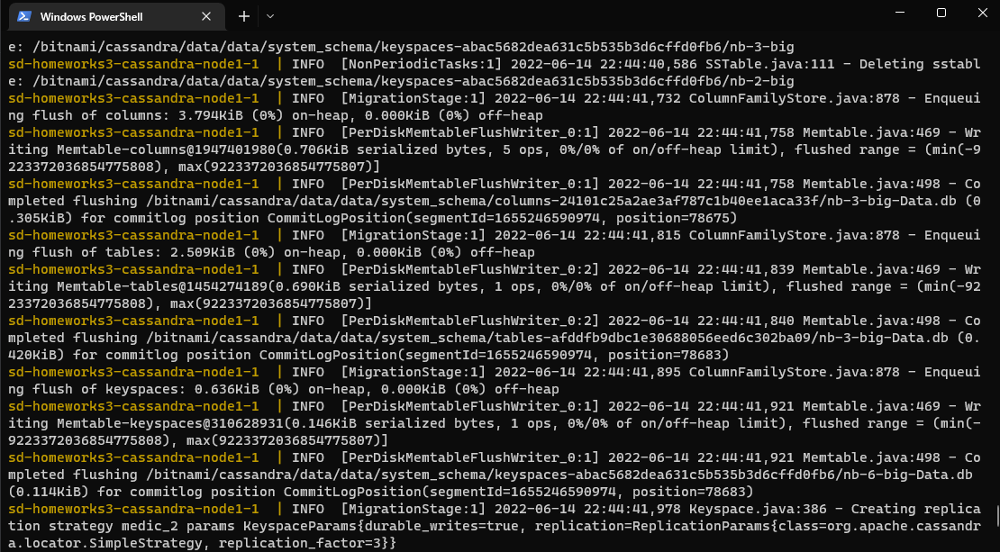
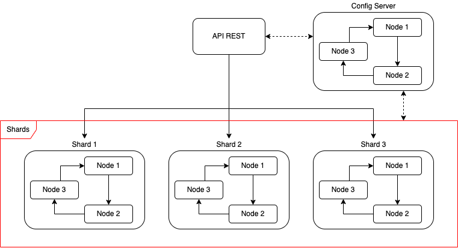

# SD-Homeworks3

## Integrantes: Ze Hui Fu y Joaquín Fernández.

**Instrucciones y uso**

1) Clonar el repositorio.
    ```bash
    https://github.com/Joacker/SD-Homeworks2.git
    ```
2) Iniciar contenedores.
    ```bash
    docker-compose up --build
    ```
    Cassandra se demora en cargar, ya que se replica hay que esperar que inicie Cassandra de los 3 nodos y cargar las tablas correspondientes. Por ende para seguir hay que esperar que los 3 nodos esten cargados correctamente, de lo contrario habrán errores (por lo general en Windows se demora más). Cuando estén los 3 nodos listos, se observará el siguiente mensaje del nodo 1:

    


3) Crear un paciente con una receta nula en la siguiente ruta:
    ```url
    http://localhost:3000/create [POST]
    ```
    ```json
    {
        "rut":"1234",
        "nombre":"javiera",
        "apellido":"salas",
        "email":"1234",
        "fecha_nacimiento":"123"
    }
    ```
    Como respuesta retornará el ID de receta.
    ```json
    {
    "ID_Receta": "0606852d-ec4c-4dab-9ca1-25fc67143584"
    }
    ```
4) Editar la receta en la siguiente ruta:
    ```url
    http://localhost:3000/edit [POST]
    ```
    ```json
    {
        "id":"0606852d-ec4c-4dab-9ca1-25fc67143584",
        "comentario": "ayayaya",
        "farmacos":"mariajuanas",
        "doctor": "simi"
    }
    ```
5) Verificar si se actualizó la receta del paciente en la siguiente ruta:
    ```url
    http://localhost:3000/getRecipes [GET]
    ```
    Retorna todas las recetas con sus respectivos pacientes.
    ```json
    {
        "id": "0606852d-ec4c-4dab-9ca1-25fc67143584",
        "comentario": "ayayaya",
        "doctor": "simi",
        "farmacos": "mariajuanas",
        "id_paciente": "acd906e9-fb1f-4cf4-bf97-af87112b1a35"
    }
    ```
6) Eliminar la receta en la siguiente ruta:
    ```url
    http://localhost:3000/delete [POST]
    ```
    ```json
    {
    "id": "0606852d-ec4c-4dab-9ca1-25fc67143584"
    }
    ```
    Para verificar que la operación se haya eliminado correctamente, realizar punto 5.

----
**Preguntas**
----
- Explique la arquitectura que Cassandra maneja. Cuando se crea el clúster ¿Cómo los nodos se conectan? ¿Qué ocurre cuando un cliente realiza una petición a uno de los nodos? ¿Qué ocurre cuando uno de los nodos se desconecta? ¿La red generada entre los nodos siempre es eficiente? ¿Existe balanceo de carga?

Casandra está construida con un sistema Peer-To-Peer. Los nodos se comunican o conectan a través de Gossip, este protocolo permite el intercambio de información entre nodos continuamente.

Cassandra no utiliza una arquitectura maestro esclavo, ya que no existen nodos primarios o secundarios, es decir que todos los nodos tienen el mismo peso o tienen la misma prioridad. Por otro lado, Cassandra utiliza una arquitectura tipo anillo, la cual se representa en la siguiente imagen:

<p align="center">
  
</p>

Como se puede observar cada nodo se conecta exactamente a otros dos nodos, formando una única ruta continua, para las señales a través de cada. Los datos viajan de un nodo a otro realizando replicación de estos. Este tipo de arquitecturas están pensadas para escalar las lecturas de forma que la carga se reparta entre varias máquinas.

Cuando se realiza una petición a uno de los nodos, este actuará como cordinador y se encargará del direccionamiento de la petición generada. Luego se generan logs de los commit para la petición, donde se dirigiran a la MemTable para despues ser almacenados en disco en SSTable en cada uno de los nodos mediante el protocolo Gossip, esto permite que la disponibilidad de los datos sea sumamente alta, ya que la red red esta en sincronia continuamente.

El cluster creado consta de 3 nodos y cada una tiene réplicas de las otras (se puede apreciar en los init-script), por lo tanto si se desconectará un solo nodo, no pasaría nada, ya que además de tener las replicas, Cassandra posee sistemas de tolerancia a fallos como: Replica placement strategy y Snitch. Los cuales proporcionan estrategias de replicación y redireccion de consultas en caso de fallos. Cabe destacar que a momento de realizar alguna desconexion, esta será alertada por Gossip a los otros nodos.

La red generada no es muy eficiente, ya que Cassandra esta construida para procesar una gran cantidad de datos, por lo tanto, es mas eficiente cuando se tiene un mayor poder de procesamiento de ram y una cantidad de datos considerable. Por otro lado, el modelo presenta una gran disponibilidad de datos y en la facilidad para la escalabilidad, pero si se realiza una escalabilidad bastante considerable es muy probable que el rendimiento se vea afectado, ya que, como es una red P2P, será muy lento navegar por tantos nodos encontrando la petición solicitada.

Como Cassandra utiliza RabdomPartitioner como balanceador de carga por defecto, las peticionas realizadas son distribuidas de manera aleatoria utilizando un hash para las columnas llaves.

- Cassandra posee principalmente dos estrategias para mantener redundancia en la replicación de datos. ¿Cuáles son estos? ¿Cuál es la ventaja de uno sobre otro? ¿Cuál utilizaría usted para en el caso actual y por qué? Justifique apropiadamente su respuesta.

Las dos estrategias principales para mantener la redundancia en la replicación de datos son: SimpleStrategy y NetworkTopologyStrategy. NetworkTopologyStrategy genera hashes para calcular un arbol hash binario, llamado Merkle. SimpleStrategy coloca réplicas en nodos posteriores en el sentido de las agujas del reloj. Por último la principal ventaja que tiene NetworkTopologyStrategy sobre SimpleStrategy es que se puede almacenar múltiples copias en diferentes datacenters.

Dado la implementación actual que utiliza solo 1 datacenter, el cual contiene a todos los nodos necesarios para el desarrollo de esta actividad. Utilizaríamos la estrategia SimpleStrategy por el simple hecho de que se posee solo un datacenter, también SimpleStrategy coloca los nodos en el sentido de las agujas del reloj, esto sería similar a la topología propuesta en el enunciado de la tarea.

- Teniendo en cuenta el contexto del problema ¿Usted cree que la solución propuesta es la correcta? ¿Qué ocurre cuando se quiere escalar en la solución? ¿Qué mejoras implementaría? Oriente su respuesta hacia el Sharding (la replicación/distribución de los datos) y comente una estrategia que podría seguir para ordenar los datos.

La solución propuesta es correcta a pequeña escala, pero si consideramos que se implementa en una clínica con millones de pacientes y millones de recetas escritas o cunsultadas a la vez, este tendría problemas de cuello de botella, ya que solo existen solamente 3 puntos en donde se pueden realizar estas peticiones, por lo tanto no será correcto tener tan pocos nodos.

Si se escala de forma vertical se tendría que aumentar la memoria de los nodos para que puedan almacenar más datos, con esta escalabilidad seguiríamos con el problema de cuello de botella. Por otro lado si se quiere escalar de forma horizontal se tendría que crear otro cluster con nodos de igual especificación que el primero y conectarlo con el culster anterior ya creado, esto produciría otro datacenter, esto solucionaría el problema de cuello de botella, ya que se tendrá mas puntos para recibir peticiones. Si se quiere aplicar una escalabilidad horizontal, se deberá aplicar la estrategia de NetworkTopologyStrategy para mantener la redundancia en la replicación de datos entre los nodos, también habrá que tener en cosideración la cantidad de nodos a la cual se quiere expandir, ya que si se expande demasiado, el sistema presentará problemas de latencia, debido a la gran cantidad de nodos por los cuales se tendrá que pasar al momento de realizar una petición.

Para realizar mejoras a la topología actual implementaríamos un sistema de Sharding, incrementando los cluster, es decir realizar un escalameinto horizontal, de tal forma que haya replicación en cada uno de los clusters y al mismo tiempo un balanceo de carga entre ellos. Por ejemplo:



Los datos se pueden distribuir por los shards, donde cada shard contiene tablas distintas, por ejemplo, la tabla de paciente en el shard 1 y la tabla de recetas en los shards 2 y 3, la tabla recetas estará presente en más shard, ya que esta tabla recibirá más peticiones. El config server almacena las rutas de los datos que contiene cada shard y aplica una política de distribución de preferencia. Además todos los cluster contienen réplicas para tener una mayor disponibilidad de los datos.

Antes de realizar la petición, primero la API REST debe consultar a config server para saber cuál shar se la debe realizar esta petición.

---
[](https://www.youtube.com/watch?v=qde6w2b2-Yo)
____
## Uso de docker compose en cassandra


[](https://www.youtube.com/watch?v=rSOjLD3C778)

_(La motivación, es un placer que solo los soñadores tenemos...)_